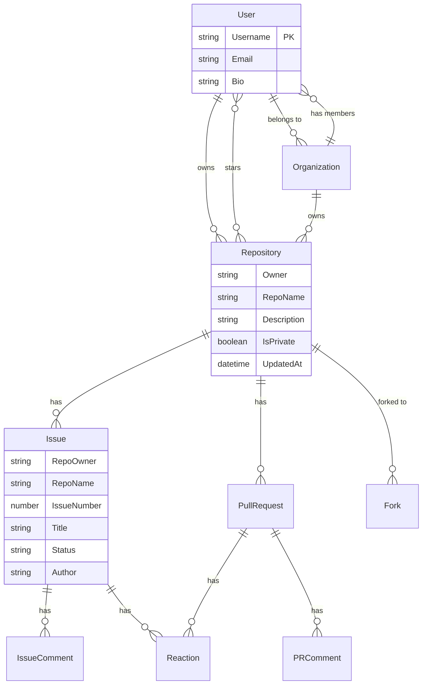

# DynamoDB Data Modeling Methodology

This guide walks through the complete data modeling process for DynamoDB single-table design.

## When to Use DynamoDB

### Ideal Scenarios

✓ **Well-defined, stable access patterns** - You can enumerate every query upfront
✓ **Predictable sub-10ms performance** - Need consistent latency at scale
✓ **Microservices with clear boundaries** - Domain-driven service design
✓ **Cost predictability matters** - Known capacity or pay-per-request
✓ **Operational workloads** - CRUD operations over analytics

### Avoid DynamoDB When

✗ **Prototyping** - Requirements remain fluid
✗ **Ad-hoc reporting/analytics** - Need flexible querying
✗ **Team lacks expertise** - Learning curve is steep
✗ **GraphQL resolvers** - Unpredictable query patterns
✗ **Complex JOINs required** - Better suited for relational

> **The Phase Transition Problem**: Simple key-value feels magical initially, but complexity balloons when modeling real relationships. Teams either abandon DynamoDB or commit fully to single-table patterns—there's no comfortable middle ground.

## Modeling Process

### Step 1: Define Entity Relationships (ERD)

Create an Entity-Relationship Diagram showing all entities and their relationships.

**Example: GitHub-like System**



**Key Questions:**
- What are the core entities?
- What are the relationships (1:1, 1:N, N:M)?
- What attributes belong to each entity?

### Step 2: Create Entity Chart (PK/SK Patterns)

Map each entity to its Primary Key (PK) and Sort Key (SK) pattern.

**GitHub Example - Main Table:**

| Entity | Partition Key (PK) | Sort Key (SK) | Purpose |
|--------|-------------------|---------------|---------|
| **User** | `ACCOUNT#{username}` | `ACCOUNT#{username}` | Direct user access |
| **Organization** | `ACCOUNT#{org_name}` | `ACCOUNT#{org_name}` | Direct org access |
| **Repository** | `REPO#{owner}#{repo_name}` | `REPO#{owner}#{repo_name}` | Direct repo access |
| **Issue** | `ISSUE#{owner}#{repo}#{padded_num}` | `ISSUE#{owner}#{repo}#{padded_num}` | Direct issue access |
| **IssueComment** | `REPO#{owner}#{repo}` | `ISSUE#{padded_num}#COMMENT#{id}` | Comments under issue |
| **Star** | `ACCOUNT#{username}` | `STAR#{owner}#{repo}#{timestamp}` | User's starred repos |
| **Fork** | `REPO#{original_owner}#{original_repo}` | `FORK#{fork_owner}` | Forks of original |
| **Counter** | `COUNTER#{org}#{repo}` | `METADATA` | Issue number sequence |

**Key Pattern Rules:**

1. **Simple Entity**: `ENTITY#{id}` - Single identifier (User, Organization)
2. **Composite Entity**: `ENTITY#{parent}#{child}` - Multiple identifiers (Repository, Issue)
3. **Hierarchical**: `PARENT#{id}` / `CHILD#{id}#...` - Parent/child split (Comments under Issue)
4. **Adjacency List**: Same PK, different SK prefixes - Many-to-many (Stars, Memberships)
5. **Temporal Sorting**: Include `#{timestamp}` in SK - Time-ordered (Stars, Activities)

**Zero-Padding for Numeric IDs:**
```
Issue #1   → ISSUE#owner#repo#00000001
Issue #999 → ISSUE#owner#repo#00000999
```
Ensures lexicographic sorting matches numeric order.

### Step 3: Design GSI Strategy

Plan Global Secondary Indexes for secondary access patterns.

**GSI Design Principles:**
- GSI1/GSI2: Alternate entity lookups, inverted relationships
- GSI3: Parent-child queries with temporal sorting
- GSI4: Status-based or filtered queries

**GitHub Example - GSI Tables:**

#### GSI1: Collection Queries

| Entity | GSI1PK | GSI1SK | Access Pattern |
|--------|--------|--------|----------------|
| **User** | `ACCOUNT#{username}` | `ACCOUNT#{username}` | Account lookup |
| **Organization** | `ACCOUNT#{org_name}` | `ACCOUNT#{org_name}` | Account lookup |
| **Repository** | `REPO#{owner}#{repo}` | `REPO#{owner}#{repo}` | Repo self-reference |
| **Issue** | `ISSUE#{owner}#{repo}` | `ISSUE#{padded_number}` | **List issues by repo** |
| **PullRequest** | `PR#{owner}#{repo}` | `PR#{padded_number}` | **List PRs by repo** |
| **Star** | `REPO#{owner}#{repo}` | `STAR#{username}#{timestamp}` | **List stargazers** |

#### GSI2: Entity-Specific Queries

| Entity | GSI2PK | GSI2SK | Access Pattern |
|--------|--------|--------|----------------|
| **Repository** | `REPO#{owner}#{repo}` | `REPO#{owner}#{repo}` | Repo self-lookup |
| **Fork** | `REPO#{original_owner}#{original_repo}` | `FORK#{fork_owner}` | **Find all forks of original repo** |

#### GSI3: Temporal Hierarchical Queries

| Entity | GSI3PK | GSI3SK | Access Pattern |
|--------|--------|--------|----------------|
| **User** | `ACCOUNT#{username}` | `ACCOUNT#{username}` | User lookup |
| **Organization** | `ACCOUNT#{org_name}` | `ACCOUNT#{org_name}` | Org lookup |
| **Repository** | `ACCOUNT#{owner}` | `#{updated_at}` | **List repos by owner, sorted by date** |

The `#` prefix on GSI3SK ensures repositories sort before the account record itself.

#### GSI4: Status-Based Filtering

| Entity | GSI4PK | GSI4SK | Access Pattern |
|--------|--------|--------|----------------|
| **Repository** | `REPO#{owner}#{repo}` | `#REPO#{owner}#{repo}` | Repo metadata |
| **Open Issue** | `ISSUE#{owner}#{repo}` | `ISSUE#OPEN#{reverse_padded_num}` | **Open issues (newest first)** |
| **Closed Issue** | `ISSUE#{owner}#{repo}` | `#ISSUE#CLOSED#{padded_num}` | **Closed issues (oldest first)** |

**Smart Sort Key Design:**
```typescript
// Open issues: Reverse numbering for newest-first
const reverseNumber = String(99999999 - issue_number).padStart(8, "0")
GSI4SK = `ISSUE#OPEN#${reverseNumber}`

// Closed issues: Normal numbering for oldest-first
const paddedNumber = String(issue_number).padStart(8, "0")
GSI4SK = `#ISSUE#CLOSED#${paddedNumber}`
```

The `#` prefix ensures closed issues sort after open issues when querying without range filter.

### Step 4: Document Access Patterns

List every query the application needs and map to table or GSI.

**Format:**

| Access Pattern | Query Type | Table/Index | Partition Key | Sort Key Condition |
|----------------|-----------|-------------|---------------|-------------------|
| Get user by username | GetItem | Main | `ACCOUNT#{username}` | Equal |
| List repos by owner | Query | GSI3 | `ACCOUNT#{owner}` | `beginsWith("#")` |
| List issues for repo | Query | GSI1 | `ISSUE#{owner}#{repo}` | All |
| List open issues for repo | Query | GSI4 | `ISSUE#{owner}#{repo}` | `beginsWith("ISSUE#OPEN#")` |
| Get stargazers for repo | Query | GSI1 | `REPO#{owner}#{repo}` | `beginsWith("STAR#")` |
| Get user's starred repos | Query | Main | `ACCOUNT#{username}` | `beginsWith("STAR#")` |
| Find forks of repo | Query | GSI2 | `REPO#{owner}#{repo}` | `beginsWith("FORK#")` |

**Critical Rule:** If you can't map an access pattern to a GetItem or Query, you need to redesign your keys or add a GSI. **Never rely on Scan in production.**

## Key Design Patterns

### 1. Overloaded Attributes

Use the same key pattern for multiple entity types.

**Example:** `ACCOUNT#` prefix for both Users and Organizations
- Simplifies queries when you want "all accounts"
- Use entity type attribute (`_et`) to distinguish in code

### 2. Item Collections

Group related items under the same partition key.

**Example:** Comments under an issue
```
PK: REPO#owner#repo
SK: ISSUE#00000001#COMMENT#c1
SK: ISSUE#00000001#COMMENT#c2
SK: ISSUE#00000001#COMMENT#c3
```

Query with `partition = "REPO#owner#repo"` and `range.beginsWith("ISSUE#00000001#COMMENT#")`

### 3. Adjacency List (Many-to-Many)

Store both sides of the relationship as separate items.

**Example:** Stars (Users ↔ Repositories)

Main Table:
```
PK: ACCOUNT#alice    SK: STAR#owner#repo1#2024-01-01  (Alice starred repo1)
PK: ACCOUNT#bob      SK: STAR#owner#repo1#2024-01-02  (Bob starred repo1)
```

GSI1:
```
GSI1PK: REPO#owner#repo1  GSI1SK: STAR#alice#2024-01-01  (repo1 starred by Alice)
GSI1PK: REPO#owner#repo1  GSI1SK: STAR#bob#2024-01-02    (repo1 starred by Bob)
```

Enables bidirectional queries:
- User's starred repos: Query main table with `PK = ACCOUNT#alice`, `SK begins_with STAR#`
- Repo's stargazers: Query GSI1 with `GSI1PK = REPO#owner#repo1`, `GSI1SK begins_with STAR#`

### 4. Sparse Indexes

Only items with the GSI attributes appear in the GSI. Use this to filter item types.

**Example:** Not all entities have GSI4PK/SK - only repositories and issues appear in GSI4.

### 5. Composite Sort Keys

Enable complex querying and sorting by encoding multiple values in SK.

**Example:** Status + reverse number for newest-open-issues-first

## Modeling Checklist

Before writing code:

- [ ] **ERD Complete** - All entities and relationships documented
- [ ] **Entity Chart Complete** - Every entity has PK/SK pattern
- [ ] **GSI Strategy Defined** - Each GSI has clear purpose
- [ ] **Access Patterns Documented** - Every query mapped to table/GSI
- [ ] **No Scan Operations** - All queries use GetItem or Query
- [ ] **Numeric IDs Zero-Padded** - For lexicographic sorting
- [ ] **Temporal Fields Include Prefix** - `#` prefix for correct ordering
- [ ] **Many-to-Many Uses Adjacency List** - Both directions queryable

## Common Pitfalls

### ❌ Forgetting Zero-Padding

```typescript
// WRONG - "Issue 2" sorts after "Issue 10"
SK: `ISSUE#${owner}#${repo}#${issue_number}`

// RIGHT - Proper lexicographic order
SK: `ISSUE#${owner}#${repo}#${String(issue_number).padStart(8, "0")}`
```

### ❌ Missing Temporal Prefix

```typescript
// WRONG - Timestamps sort before entity records
GSI3SK: new Date().toISOString()  // "2024-01-01..." sorts before "ACCOUNT#..."

// RIGHT - # prefix ensures entity sorts first
GSI3SK: `#${new Date().toISOString()}`
```

### ❌ Not Planning for Many-to-Many

```typescript
// WRONG - Can only query one direction
PK: ACCOUNT#{user}    SK: REPO#{owner}#{repo}

// RIGHT - Use adjacency list with GSI inversion
PK: ACCOUNT#{user}    SK: STAR#{owner}#{repo}#{timestamp}
GSI1PK: REPO#{owner}#{repo}  GSI1SK: STAR#{user}#{timestamp}
```

### ❌ Overusing GSIs

Each GSI doubles storage costs. Evaluate if access pattern is needed or if client-side filtering suffices.

## Example: Full Modeling Session

**Requirement:** Model a GitHub-like system

**1. ERD:** (See diagram above)

**2. Entity Chart:**
- User: `ACCOUNT#{username}` / `ACCOUNT#{username}`
- Repository: `REPO#{owner}#{repo}` / `REPO#{owner}#{repo}`
- Issue: `ISSUE#{owner}#{repo}#{padded_num}` / same
- IssueComment: `REPO#{owner}#{repo}` / `ISSUE#{padded_num}#COMMENT#{id}`
- Star: `ACCOUNT#{user}` / `STAR#{owner}#{repo}#{timestamp}`

**3. GSI Strategy:**
- GSI1: Collection queries (issues by repo, stargazers)
- GSI2: Fork relationships
- GSI3: Temporal owner queries (repos by owner with sorting)
- GSI4: Status filtering (open vs closed issues)

**4. Access Patterns:**
- ✓ Get user → Main table GetItem
- ✓ List user's repos → GSI3 Query with reverse sort
- ✓ List issues for repo → GSI1 Query
- ✓ List open issues → GSI4 Query with beginsWith
- ✓ Get stargazers → GSI1 Query
- ✓ Get user's stars → Main table Query

**5. Validate:**
- No Scan operations needed ✓
- All numeric IDs padded ✓
- Temporal fields prefixed ✓
- Many-to-many (stars) use adjacency list ✓

**Ready to implement!**
